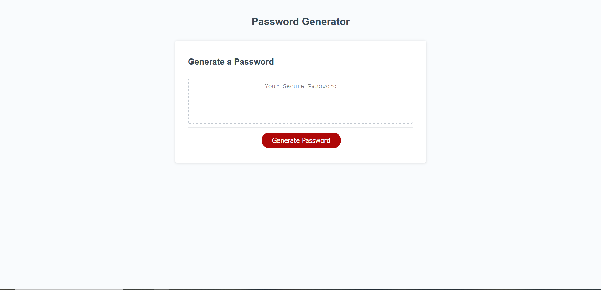

# password-generator

This is a password generator! It takes in 5 different parameters, length (between 8 and 128), and whether or not there will be upper or lowercase letters, numbers, or symbols. All you need to do is click the aptly named button that says "Generate Password" and you will be guided through a series of prompts asking what kind of characters you want in your password, in addition to how long. You will be gauranteed a selection from each character type you choose, so the base level security from these passwords is going to be quite solid. Enjoy! 

https://b-e-christensen.github.io/password-generator/
